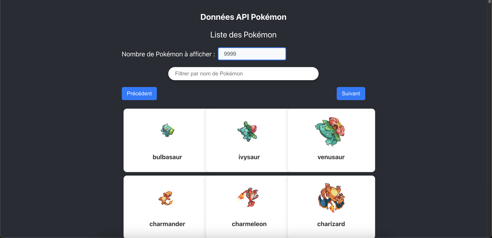

# Projet NodeJS - Requête API

## Description
Ce projet est une application NodeJS qui effectue des requêtes à une API externe et affiche les résultats.



## Installation
1. Clonez le dépôt :
    ```bash
    git clone https://github.com/votre-utilisateur/votre-repo.git
    ```
2. Installez les dépendances :
    ```bash
    cd votre-repo
    npm install
    ```

## Utilisation
Pour démarrer l'application, exécutez :
```bash
npm start
```

## Contribuer
Les contributions sont les bienvenues. Veuillez soumettre une pull request.

## Licence
Ce projet est sous licence MIT.